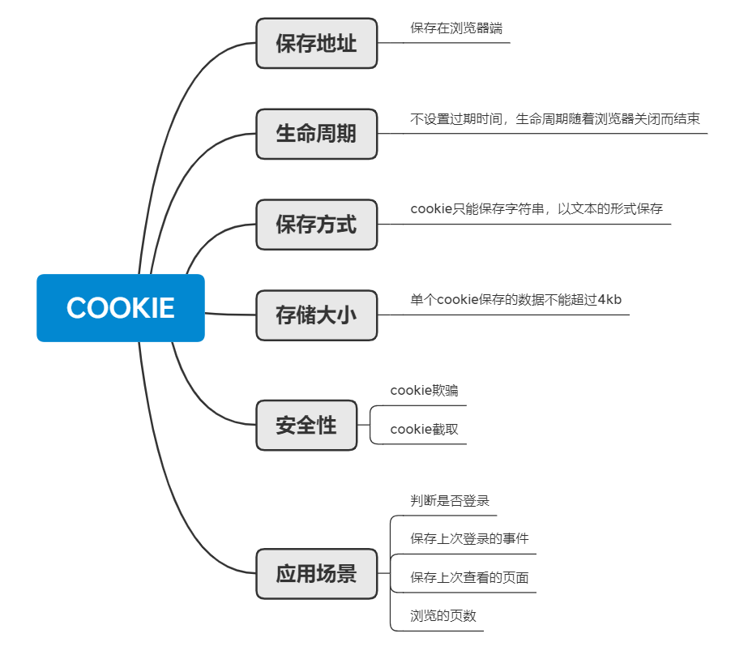

# HTTP缓存与本地存储

## 前言

作为一个前端开发er，我们除了基本的HTML，CSS，JS以及一些Vue，React这些框架之外，我们还需要了解一些其他的知识，比如http和浏览器相关的知识，才能帮助我们更好地完成需求或者做些一前端方面的优化，进而成为一个更好的前端工程师。因此，今天我想来讲一讲HTTP缓存和本地存储这两部分的内容


## 一 HTTP缓存

通过复用以前获取的资源，可以显著提高网站和应用程序的性能。Web 缓存减少了等待时间和网络流量，因此减少了显示资源表示形式所需的时间。通过使用 HTTP缓存，变得更加响应性。而浏览器缓存主要分为两种，强缓存和协商缓存


### 1.1 强缓存

> 强缓存所谓的“强”，在于强制让浏览器按照一定时间范围内来存储来自服务器的资源，有点强制的味道～，强缓存是利用Expires或者Cache-Control，不发送请求，直接从缓存中取，请求状态码会返回200（from cache）


#### 1.1.1 Expires(已逐步淘汰)

> Expires是HTTP/1.0中提及的，让服务器为文件资源设置一个过期时间，在多长时间内可以将这些内容视为最新的，允许客户端在这个时间之前不去检查，MDN 具体介绍 [点此](https://developer.mozilla.org/zh-CN/docs/Web/HTTP/Headers/Expires)


- 指定到期时间

指定缓存到期GMT的绝对时间，如果expires到期需要重新请求

```js
Expires:Sat, 09 Jun 2020 08:13:56 GMT
```


#### 1.1.2 Cache-Control（主要）

> 相比上一小节讲的 expires，两者有什么区别呢？ Cache-Control 你可以理解成为高级版expires，为了弥补Expires的缺陷在Http1.1协议引入的，且强大之外优先级也更高，也就是当Expires和Cache-Control同时存在时，Cache-Control 会覆盖Expires的配置，即Cache-Control ( Http 1.1 ) > Expires ( Http 1.0 )


Cache-Control 比Expires比较要丰富，具备更多的属性，其中包括如下

+ max-age ： 设置资源的过期时间（效果与expires一样，但是这里的时间是相对于请求的时间，那边是绝对时间）

+ no-cache ：可以在本地缓存，可以在代理服务器缓存，需要先验证才可使用缓存（使用下面的协商缓存）

+ no-store ： 禁止浏览器缓存，只能通过服务器获取

- public：可以被所有的用户缓存，包括终端用户和CDN等中间代理服务器。
- private：只能被终端用户的浏览器缓存，不允许CDN等中继缓存服务器对其缓存。

例子演示：

```js
// 设置缓存时间为1年
Cache-Control: max-age=31536000
Expires:Sat, 09 Jun 2020 08:13:56 GMT //同时设置两个，Expires会失效
```

则意味着浏览器可以缓存一年的时间，无需请求服务器，如果同时声明Expires和Cache-Control，Expires将失效


### 1.2 协商缓存

> 协商缓存就是由服务器来确定缓存资源是否可用，所以客户端与服务器端要通过某种标识来进行通信，从而让服务器判断请求资源是否可以缓存访问。
>
> 主要涉及到两组header字段：Etag和If-None-Match、Last-Modified和If-Modified-Since。


#### 1.2.1 Last-Modified （Http 1.0）

+ 第一次请求：当浏览器第一次请求服务器资源时，服务器通过Last-Modified 来设置响应头的缓存标识，把资源最后修改的时间作为值写入，再将资源返回给浏览器

+ 第二次请求：第二次请求时，浏览器会带上 If-Modified-Since 请求头去访问服务器，服务器将 If-Modified-Since 中携带的时间与资源修改的时间对比，当时间不一致时，意味更新了，服务器会返回新资源并更新Last-Modified，当时间一致时，意味着资源没有更新，服务器会返回304状态码，浏览器将从缓存中读取资源

```js
//response header 第一次请求
Last-Modified: Wed, 21 Oct 2019 07:28:00 GMT

//request header 第二次请求
If-Modified-Since: Wed, 21 Oct 2019 07:29:00 GMT 
```


#### 1.2.2 Etag （Http 1.1）

> MDN中提到ETag 之间的比较，使用的是强比较算法，即只有在每一个字节都相同的情况下，才可以认为两个文件是相同的，而这个hash值，是由对文件的索引节、大小和最后修改时间进行Hash后得到的，而且要注意的是分布式系统不适用，了解更多[点我](https://developer.mozilla.org/zh-CN/docs/Web/HTTP/Headers/If-Match)


+ 第一次请求：也是跟上文一样，浏览器去请求服务器资源，不过这次不是通过Last-Modified了，而是用Etag来设置响应头缓存标识。Etag是由服务端生成的，然后浏览器会将Etag与资源缓存

+ 第二次请求：浏览器会将 Etag 放入 If-None-Match 请求头中去访问服务器，服务器收到后，会对比两端的标识，当两者不一致时，意味着资源更新，会从服务器的响应读取资源并更新Etag，浏览器将从缓存中读取资源，当两者一致时，意味着资源没有更新，服务器会返回304状态码，浏览器将从缓存中读取资源

```js
//response header 第一次请求
ETag: "33a64df551425fcc55e4d42a148795d9f25f89d4"

//request header 第二次请求
If-None-Match: "33a64df551425fcc55e4d42a148795d9f25f89d4"
```

对比完 Last-Modified 与 Etag，我们可以很显然看到，协商缓存每次请求都会与服务器发生“关系”，第一次请求都是拿数据和标识，而第二次请求就是浏览器“咨询”服务器是否资源已经更新的过程。

同时，如果以上两种方式同时使用，Etag 优先级会更高，即 Etag( Http 1.1 ) > Last-Modified ( Http 1.0 )


### 1.3 缓存状态码

#### 1.3.1 状态码 200 OK（from cache）

> ①这是浏览器没有跟服务器确认，直接用了浏览器缓存，性能最好的，没有网络请求，那么什么情况会出现这种情况？一般在expires或者 Cache-Control 中的max-age头部有效时会发生。


#### 1.3.2 状态码 304 Not Modified

> 是浏览器和服务器“交流”了，确定使用缓存后，再用缓存，也就是第二节讲的通过Etag或Last-Modified的第二回合中对比，对比两者一致，则意味资源不更新，则服务器返回304状态码


#### 1.3.3 状态码 200

> 以上两种缓存全都失败，也就是未缓存或者缓存过期，需要浏览器去获取最新的资源，效率最低 


### 1.4 缓存小结

一句话：

HTTP缓存主要分为两种，强缓存和协商缓存，其中：

强缓存利用 Cache-Control（max-age）, Expires，检测缓存是否过期

协商缓存利用 Last-Modified，Etag，检测缓存是否有效


## 二 本地存储

下面说一说常用的本地存储方法

- cookie

- localStorage

- sessionStorage

  

### 2.1 cookie

HTTP Cookie（也叫 Web Cookie 或浏览器 Cookie）是服务器发送到用户浏览器并保存在本地的一小块数据，它会在浏览器下次向同一服务器再发起请求时被携带并发送到服务器上。


Cookie 曾一度用于客户端数据的存储，因当时并没有其它合适的存储办法而作为唯一的存储手段，但现在随着现代浏览器开始支持各种各样的存储方式，Cookie 渐渐被淘汰。由于服务器指定 Cookie 后，浏览器的每次请求都会携带 Cookie 数据，会带来额外的性能开销（尤其是在移动环境下）。新的浏览器API已经允许开发者直接将数据存储到本地，如使用 [Web storage API](https://developer.mozilla.org/zh-CN/docs/Web/API/Web_Storage_API) （本地存储和会话存储）


Cookie 主要用于以下三个方面：

- 会话状态管理（如用户登录状态、购物车、游戏分数或其它需要记录的信息）
- 个性化设置（如用户自定义设置、主题等）
- 浏览器行为跟踪（如跟踪分析用户行为等）


#### 2.1.1 cookie的基本使用

在服务端使用

当服务器收到 HTTP 请求时，服务器可以在响应头里面添加一个 [`Set-Cookie`](https://developer.mozilla.org/zh-CN/docs/Web/HTTP/Headers/Set-Cookie) 选项。浏览器收到响应后通常会保存下 Cookie，之后对该服务器每一次请求中都通过 [`Cookie`](https://developer.mozilla.org/zh-CN/docs/Web/HTTP/Headers/Cookie) 请求头部将 Cookie 信息发送给服务器。另外，Cookie 的过期时间、域、路径、有效期、适用站点都可以根据需要来指定。

```
Set-Cookie: <cookie名>=<cookie值>
```

然后里边可以附带一些选项是选填的

- expires

- domain

- path

- secure

- ...

  

#### 2.1.2 cookie的选项

expires是设置cookie的过期时间的，如果没有设置expires的话，默认是当前的会话，即关闭浏览器后cookie失效

```js
Set-Cookie: id=a3fWa; Expires=Wed, 21 Oct 2015 07:28:00 GMT
```

domain是指定了cookie将要被发送的域，默认是创建了这个cookie的域名

```js
Set-Cookie:name=aa; domain=aaa.net
```

path顾名思义，路径，就是说在请求的时候，url里边必须要存在这个路径，才会发送cookie这个消息头

```js
Set-Cookie:name=aa; domain=aaa.net; path=/
```

secure，这个选项是一个标记，不用赋值，这个标记代表着只有通过https创建得请求才能被发送到服务器

```js
Set-Cookie: id=a3fWa; Expires=Wed, 21 Oct 2015 07:28:00 GMT; Secure
```


上边讲了cookie的创建，那么修改得话是不是和创建一样呢，答案是否定的，
cookie并不能像变量一样随意的修改赋值


#### 2.1.3 cookie的修改

想要改变cookie的值的话，首先要确定之前讲的四个选项中domain和path都是相同的才可以
，其中有一个不同的时候都会创建出一个新的cookie，比如说

```
Set-Cookie:name=aa; domain=aaa.net; path=/
        
Set-Cookie:name=aa; domain=aaa.net; path=/xxx
```

这样的话并不会修改之前的cookie ，只会创建一个新的cookie，再比如说

```
Set-Cookie:name=aa; domain=aa.net; path=/

Set-Cookie:name=bb; domain=aa.net; path=/
```

上边这种的话是会把之前的cookie修改掉的


#### 2.1.4 cookie的删除

还有一个cookie的删除

在之前我们说到了在这四个选项之中有一个过期时间，最常用的方法就是给cookie设置一个过期的时间，这样cookie会被浏览器删除。

当然也存在其他的删除情况，比如说浏览器被关闭，或者说 cookie超出限制，这个限制根据不同的浏览器，数量也不一样，一般都是20个


cookie常常被用来跟踪用户信息，或者校验用户身份等等，在cookie里边放一些敏感的信息是很不明智的，因为cookie是明文传输，很容易被别有用心的人利用

另外cookie本身的话，不是那种真正意义上的本地存储，因为cookie的大小最大只有4kb大

下面讲一下，真正的本地存储 -- sessionStorage和localStorage


#### 2.1.5 cookie的应用场景

+ 判断是否登录
+ 保存上次登录的事件
+ 保存上次查看的页面
+ 浏览的页数
+ 用来记录购物车或者记录用户使用偏好来制定推送


### 2.2 sessionStorage

#### 2.2.1 是什么

会话存储，它与 [`localStorage`](https://developer.mozilla.org/zh-CN/docs/Web/API/Window/localStorage) 相似，不同之处在于 `localStorage` 里面存储的数据没有过期时间设置，而存储在 `sessionStorage` 里面的数据在页面会话结束时会被清除，具体声明周期如下：

- 页面会话在浏览器打开期间一直保持，并且重新加载或恢复页面仍会保持原来的页面会话
- 打开多个相同的URL的Tabs页面，会创建各自的`sessionStorage`
- 闭对应浏览器窗口（Window）/ tab，会清除对应的`sessionStorage`
- 存储在sessionStorage或localStorage中的数据**特定于页面的协议**。也就
  是说`http://example.com` 与 `https://example.com`的sessionStorage相互隔离


#### 2.2.2 特性

上边有提到cookie的大小问题，在html5的时候，就出现了sessionStorage和localStorage

sessionStorage和localStorage 都受到同源策略限制，就是跨域问题，在访问sessionStorage和localStorage 的时候，页面必须在同一个域名，使用同一个协议，并且一个端口

sessionStorage在使用中有很严格的要求，他在一个tab页里边不能被另一个tab页使用

sessionStorage会在标签页被关闭的时候被清空

sessionStorage和localStorage 也有大小限制，相比cookie就大了很多，是5M


#### 2.2.2 使用

```js
// 下面的代码访问当前域名的 session Storage 对象，并使用 sessionStorage.setItem() 访问往里面添加一个数据条目;或者，直接设置也是可以的
sessionStorage.setItem('key', 'value');
sessionStorage.name='123'

// 从 sessionStorage 获取数据，下面2种方式都是可以的
let data = sessionStorage.getItem('key');
let data2 = sessionStorage.name;

// 从 sessionStorage 删除保存的数据
sessionStorage.removeItem('key');

// 从 sessionStorage 删除所有保存的数据
sessionStorage.clear();
```


#### 2.2.3 应用场景

有，比如说我们都制动，在页面刷新的时候，我们写的js里边的变量函数等等的，内存会被释放掉，那么这个时候可以用sessionStorage来存储一些不想被释放掉内存的数据，比如说记录一个滚动条的位置，或者播放器的进度，敏感账号的一次性登录等等，下面是其中一个应用场景：

```js
// 获取文本输入框
let field = document.getElementById("field");

// 检测是否存在 autosave 键值
// (这个会在页面偶然被刷新的情况下存在)
if (sessionStorage.getItem("autosave")) {
  // 恢复文本输入框的内容
  field.value = sessionStorage.getItem("autosave");
}

// 监听文本输入框的 change 事件
field.addEventListener("change", function() {
  // 保存结果到 sessionStorage 对象中
  sessionStorage.setItem("autosave", field.value);
});
```


### 2.3 localStorage

#### 2.3.1 是什么

现在说一说这个localStorage，刚才又说到sessionStorage是不可以跨页的，那么这个限制，叫他本地存储是有点牵强的，下边要说的这个localStorage，他和sessionStorage有些不同，他可以进行跨页读取，是一个真正的本地存储，不会因为浏览器的关闭而清除数据，如果你不进行手动清除的话，它是会一直存在的


#### 2.3.2 特性

+ 同源（协议，域名，端口号相同），使用同一个localStorage，否则不是同一个
+ 除非主动删除数据，否则数据永远不会消失
+ 存储大小和sessionStorage一样是5Mb


#### 2.3.3 使用

下面的代码片段访问了当前域名下的本地 [`Storage`](https://developer.mozilla.org/zh-CN/docs/Web/API/Storage) 对象，并通过 [`Storage.setItem()`](https://developer.mozilla.org/zh-CN/docs/Web/API/Storage/setItem) 增加了一个数据项目。

```js
localStorage.setItem('myCat', 'Tom');
```

该语法用于读取 `localStorage` 项，如下:

```js
let cat = localStorage.getItem('myCat');
```

该语法用于移除 `localStorage` 项，如下:

```js
localStorage.removeItem('myCat');
```

该语法用于移除所有的 `localStorage` 项，如下:

```js
// 移除所有
localStorage.clear();
```


#### 2.3.3 应用场景

适合长期保存在本地的数据


### 2.4 本地存储小结




## 本文总结

看了这篇文章，你可以尝试回答如下问题：

+ http缓存
  1. http缓存是什么，有什么作用？
  2. http缓存主要分为哪两类？
  3. 强缓存包含哪些，怎么用的？
  4. 协商缓存包含哪些，怎么用的？
  5. 缓存状态码有哪些？什么情况会显示对应的状态码？
+ 本地储存
  1. 本地储存包含什么？
  2. 描述一下你了解的cookie？
  3. 描述一下你了解的sessionStorage
  4. 描述一下你了解的localStorage
  5. sessionStorage和localStorage的区别？
  6. cookie和Web Storage的区别？

如果对上面的问题觉得不清楚，或者模棱两可，请再一次阅读本文后回答


参考资料：

[HTTP 缓存](https://developer.mozilla.org/zh-CN/docs/Web/HTTP/Caching_FAQ)

[HTTP cookies](https://developer.mozilla.org/zh-CN/docs/Web/HTTP/Cookies)

[Window.localStorage](https://developer.mozilla.org/zh-CN/docs/Web/API/Window/localStorage)

[Window.sessionStorage](https://developer.mozilla.org/zh-CN/docs/Web/API/Window/sessionStorage)

[sessionStorage与localStorage的区别及应用场景](https://www.jianshu.com/p/e0c1b3b42c6f)

[浏览器缓存原理以及本地存储](https://www.jianshu.com/p/17557b5d983e)