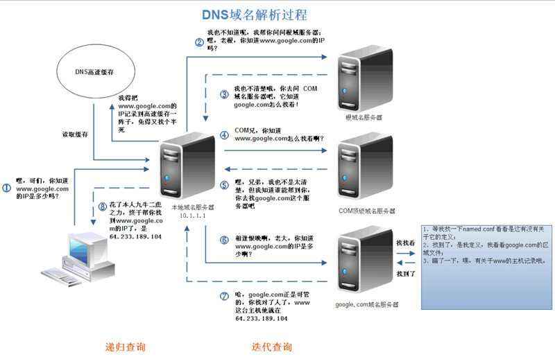
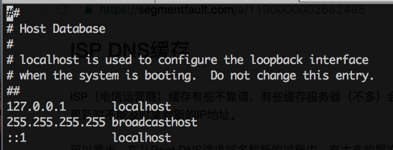
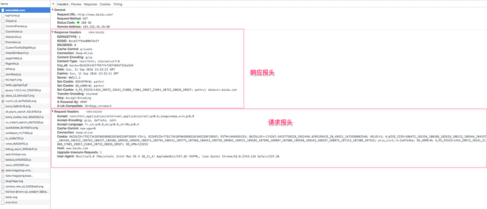
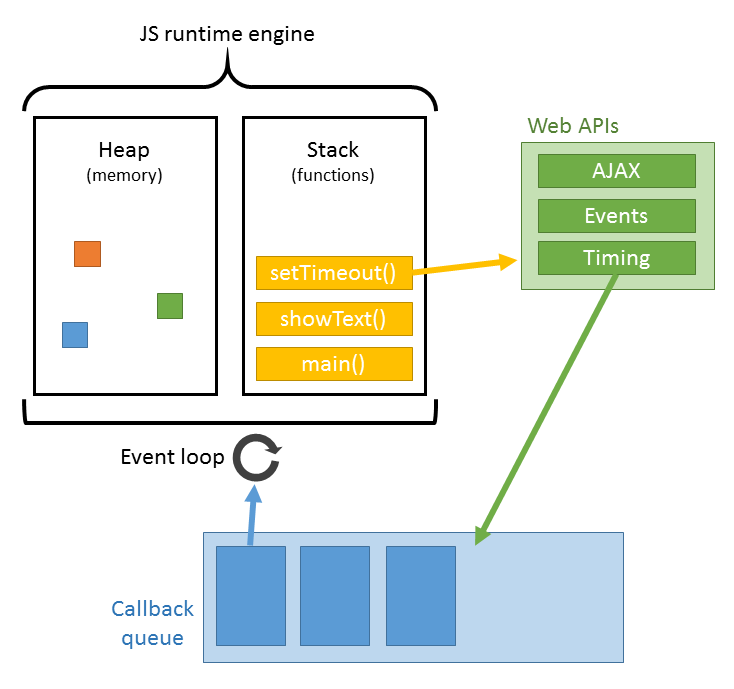

# 输入url到页面加载经历了什么

## 一 前言

相信大家在面试的时候或多或少都会被问到一道很经典的面试题：请问从输入url到页面加载经历了什么？

当我们被问到的时候，相信心里面就会开始描述了：首先进行DNS解析，然后建立TCP链接，接下来....

总的来说，一般就是把几个步骤说一下，然后再把里面的内容简单说一下，撑死2分钟说完。诚然，这样的回答各个点都有了，是合格的，但是，并不会多加分。事实上，这是一道比较综合的题目，如果我们能够把这个问题里面各个点更加详细地描述并加以拓展，那么是可以说明我们的知识是扎实而且成体系的，而这无疑是很加分的。


那么，本文会围绕这个问题的回答，主要对回答中各个流程进行一个更为详细的描述和拓展，让你在这道题的回答能够惊(diao)艳(da)面试官


## 二 大概过程

那么，从输入url到页面加载究竟经历了什么呢？

总体来说会分为以下几个过程:

1. DNS解析
2. TCP连接（三次握手）
3. 发送HTTP请求
4. 服务器处理请求并返回HTTP报文
5. 浏览器解析渲染页面
6. 连接结束（四次挥手）


下面来详细介绍各个部分：


## 三 具体过程

### 3.1 DNS解析

DNS解析的过程就是寻找哪台机器上有你需要资源的过程。当你在浏览器中输入一个地址时，例如www.baidu.com，其实不是百度网站真正意义上的地址。互联网上每一台计算机的唯一标识是它的IP地址，但是IP地址并不方便记忆。用户更喜欢用方便记忆的网址去寻找互联网上的其它计算机，也就是上面提到的百度的网址。所以互联网设计者需要在用户的方便性与可用性方面做一个权衡，这个权衡就是一个网址到IP地址的转换，这个过程就是DNS解析。它实际上充当了一个翻译的角色，实现了网址到IP地址的转换。网址到IP地址转换的过程是如何进行的？


**域名解析的流程：**

1. **查找浏览器缓存**——我们日常浏览网站时，浏览器会缓存DNS记录一段时间。如果以前我们访问过该网站，那么在浏览器中就会有相应的缓存记录。因此，我们输入网址后，浏览器会首先检查缓存中是否有该域名对应的IP信息。如果有，则直接返回该信息供用户访问网站，如果查询失败，会从系统缓存中进行查找。

2. **查找系统缓存**——从**hosts文件**中查找是否有存储的DNS信息，如果查询失败，可从路由器缓存中继续查找

3. **查找路由器缓存**——如果之前访问过相应的网站，一般路由器也会缓存信息。如果查询失败，可继续从 ISP DNS 缓存查找。

4. **查找ISP DNS缓存**——从**本地域名服务器**，通常是我们的网络服务商（例如电信）的DNS缓存信息中查找。

5. 如果经由以上方式都没找到对应IP的话，则由**本地域名服务器**向**根域名服务器查找**域名对应的IP地址，找到则返回并停止后面的查询，找不到则告诉本地域名服务器找不到；此时，**本地域名服务器**会向**顶级域名服务器** 查找，找到则返回并停止后面的查询，找不到则告诉本地域名服务器找不到；此时，**本地域名服务器**会向**二级域名服务器**......如此类推....直到**最终的对应域名**对应的 X级服务器返回到最终的记录（找到或者找不到）给本地名称服务器。

   

下面这张图很完美的解释了上面 5 的查询过程：




**问题：有时候会提到DNS优化，那么什么是DNS优化？**

DNS的优化主要有两点：1.DNS缓存	2.DNS负载均衡


DNS缓存

上文中请求到google的IP地址时，经历了好多个步骤，其中都有提到缓存，事实上，DNS优化的其中一个点就是利用缓存。

DNS存在着多级缓存，从离浏览器的距离排序的话，有以下几种: 浏览器缓存，系统缓存，路由器缓存，IPS服务器缓存，根域名服务器缓存，顶级域名服务器缓存，主域名服务器缓存。

- 在你的chrome浏览器中输入:chrome://dns/，你可以看到chrome浏览器的DNS缓存。
- 系统缓存主要存在/etc/hosts(Linux系统)中:



- ...

  

DNS负载均衡

不知道大家有没有思考过一个问题: DNS返回的IP地址是否每次都一样？如果每次都一样是否说明你请求的资源都位于同一台机器上面，那么这台机器需要多高的性能和储存才能满足亿万请求呢？其实真实的互联网世界背后存在成千上百台服务器，大型的网站甚至更多。但是在用户的眼中，它需要的只是处理他的请求，哪台机器处理请求并不重要。DNS可以返回一个合适的机器的IP给用户，例如可以根据每台机器的负载量，该机器离用户地理位置的距离等等，这种过程就是DNS负载均衡，又叫做DNS重定向。大家耳熟能详的CDN(Content Delivery Network)就是利用DNS的重定向技术，DNS服务器会返回一个跟用户最接近的点的IP地址给用户，CDN节点的服务器负责响应用户的请求，提供所需的内容。


### 3.2 TCP连接（三次握手）

三次握手真的作用其实就是确保客户端和服务器双方都做好了发送和接收的准备：

简单描述就是：

```txt
客户端：浏览器发给服务器，告诉服务器我准备好了，将要发送请求
服务端：服务器发送给浏览器，告诉浏览器我也准备好了，需要和你再次确认一下
客户端：浏览器发送给服务器，告诉服务器确认完毕，马上发送请求
```


**问题：为什需要三次握手？**

《计算机网络》第四版中讲“三次握手”的目的是“为了防止已失效的连接请求报文段突然又传送到了服务端，因而产生错误”

书中的例子是这样的，“已失效的连接请求报文段”的产生在这样一种情况下：client发出的第一个连接请求报文段并没有丢失，而是在某个网络结点长时间的滞留了，以致延误到连接释放以后的某个时间才到达server。本来这是一个早已失效的报文段。但server收到此失效的连接请求报文段后，就误认为是client再次发出的一个新的连接请求。于是就向client发出确认报文段，同意建立连接。

**假设不采用** “三次握手”，那么只要server发出确认，新的连接就建立了。由于现在client并没有发出建立连接的请求，因此不会理睬server的确认，也不会向server发送数据。但server却以为新的运输连接已经建立，并**一直等待client发来数据**。这样，server的很多资源就白白浪费掉了。采用“三次握手”的办法可以防止上述现象发生。例如刚才那种情况，client不会向server的确认发出确认。server由于收不到确认，就知道client并没有要求建立连接。”。主要目的防止server端一直等待，浪费资源。


### 3.3 客户端发送HTTP请求

其实这部分又可以称为前端工程师眼中的HTTP，它主要发生在客户端。发送HTTP请求的过程就是构建HTTP请求报文并通过TCP协议中发送到服务器指定端口(HTTP协议80/8080, HTTPS协议443)。HTTP请求报文是由三部分组成: **请求行**, **请求报头**和**请求正文**。


**请求行**

格式如下:
`Method Request-URL HTTP-Version CRLF`

```
eg: GET index.html HTTP/1.1
```

常用的方法有: GET, POST, PUT, DELETE, OPTIONS, HEAD


**请求报头**

请求报头允许客户端向服务器传递请求的附加信息和客户端自身的信息。
PS: 客户端不一定特指浏览器，有时候也可使用Linux下的CURL命令以及HTTP客户端测试工具等。

请求报头其实就是一些键值对

常见的请求报头有: Accept, Accept-Charset, Accept-Encoding, Accept-Language, Content-Type, Authorization, Cookie, User-Agent等。





上图是使用Chrome开发者工具截取的对百度的HTTP请求以及响应报文，从图中可以看出，请求报头中使用了Accept, Accept-Encoding, Accept-Language, Cache-Control, Connection, Cookie等字段。

Accept用于指定客户端用于接受哪些类型的信息

Accept-Encoding与Accept类似，它用于指定接受的编码方式

Connection设置为Keep-alive用于告诉客户端本次HTTP请求结束之后并不需要关闭TCP连接，这样可以使下次HTTP请求使用相同的TCP通道，节省TCP连接建立的时间。


**请求正文**

当使用POST, PUT等方法时，通常需要客户端向服务器传递数据。这些数据就储存在请求正文中。在请求包头中有一些与请求正文相关的信息，例如: 现在的Web应用通常采用Rest架构，请求的数据格式一般为json。这时就需要设置Content-Type: application/json。


### 3.4 服务器处理请求并返回HTTP报文

自然而然这部分对应的就是后端工程师眼中的HTTP。后端从在固定的端口接收到TCP报文开始，它会对TCP连接进行处理，对HTTP协议进行解析，并按照报文格式进一步封装成HTTP Request对象，供上层使用。这一部分工作一般是由Web服务器去进行。

HTTP响应报文也是由三部分组成: **状态码**, **响应报头**和**响应报文**。


**状态码**

状态码是由3位数组成，第一个数字定义了响应的类别，且有五种可能取值:

- 1xx：指示信息–表示请求已接收，继续处理。
- 2xx：成功–表示请求已被成功接收、理解、接受。
- 3xx：重定向–要完成请求必须进行更进一步的操作。
- 4xx：客户端错误–请求有语法错误或请求无法实现。
- 5xx：服务器端错误–服务器未能实现合法的请求。


下面是常见的HTTP状态码：

- 200 - 请求成功
- 301 - 资源（网页等）被永久转移到其它URL
- 302 - 
- 304
- 400
- 401
- 403
- 404 - 请求的资源（网页等）不存在
- 422
- 500 - 内部服务器错误


更加详细的状态码介绍可以查看：

[HTTP状态码](https://www.runoob.com/http/http-status-codes.html)


**响应报头**

响应报头其实就是一些键值对

常见的响应报头字段有:

| 应答头           | 说明                                                         |
| :--------------- | :----------------------------------------------------------- |
| Allow            | 服务器支持哪些请求方法（如GET、POST等）。                    |
| Content-Encoding | 文档的编码（Encode）方法。只有在解码之后才可以得到Content-Type头指定的内容类型。利用gzip压缩文档能够显著地减少HTML文档的下载时间。Java的GZIPOutputStream可以很方便地进行gzip压缩，但只有Unix上的Netscape和Windows上的IE 4、IE 5才支持它。因此，Servlet应该通过查看Accept-Encoding头（即request.getHeader("Accept-Encoding")）检查浏览器是否支持gzip，为支持gzip的浏览器返回经gzip压缩的HTML页面，为其他浏览器返回普通页面。 |
| Content-Length   | 表示内容长度。只有当浏览器使用持久HTTP连接时才需要这个数据。如果你想要利用持久连接的优势，可以把输出文档写入 ByteArrayOutputStream，完成后查看其大小，然后把该值放入Content-Length头，最后通过byteArrayStream.writeTo(response.getOutputStream()发送内容。 |
| Content-Type     | 表示后面的文档属于什么MIME类型。Servlet默认为text/plain，但通常需要显式地指定为text/html。由于经常要设置Content-Type，因此HttpServletResponse提供了一个专用的方法setContentType。 |
| Date             | 当前的GMT时间。你可以用setDateHeader来设置这个头以避免转换时间格式的麻烦。 |
| Expires          | 应该在什么时候认为文档已经过期，从而不再缓存它？             |
| Last-Modified    | 文档的最后改动时间。客户可以通过If-Modified-Since请求头提供一个日期，该请求将被视为一个条件GET，只有改动时间迟于指定时间的文档才会返回，否则返回一个304（Not Modified）状态。Last-Modified也可用setDateHeader方法来设置。 |
| Location         | 表示客户应当到哪里去提取文档。Location通常不是直接设置的，而是通过HttpServletResponse的sendRedirect方法，该方法同时设置状态代码为302。 |
| Refresh          | 表示浏览器应该在多少时间之后刷新文档，以秒计。除了刷新当前文档之外，你还可以通过setHeader("Refresh", "5; URL=http://host/path")让浏览器读取指定的页面。 注意这种功能通常是通过设置HTML页面HEAD区的＜META HTTP-EQUIV="Refresh" CONTENT="5;URL=http://host/path"＞实现，这是因为，自动刷新或重定向对于那些不能使用CGI或Servlet的HTML编写者十分重要。但是，对于Servlet来说，直接设置Refresh头更加方便。  注意Refresh的意义是"N秒之后刷新本页面或访问指定页面"，而不是"每隔N秒刷新本页面或访问指定页面"。因此，连续刷新要求每次都发送一个Refresh头，而发送204状态代码则可以阻止浏览器继续刷新，不管是使用Refresh头还是＜META HTTP-EQUIV="Refresh" ...＞。  注意Refresh头不属于HTTP 1.1正式规范的一部分，而是一个扩展，但Netscape和IE都支持它。 |
| Server           | 服务器名字。Servlet一般不设置这个值，而是由Web服务器自己设置。 |
| Set-Cookie       | 设置和页面关联的Cookie。Servlet不应使用response.setHeader("Set-Cookie", ...)，而是应使用HttpServletResponse提供的专用方法addCookie。参见下文有关Cookie设置的讨论。 |
| WWW-Authenticate | 客户应该在Authorization头中提供什么类型的授权信息？在包含401（Unauthorized）状态行的应答中这个头是必需的。例如，response.setHeader("WWW-Authenticate", "BASIC realm=＼"executives＼"")。 注意Servlet一般不进行这方面的处理，而是让Web服务器的专门机制来控制受密码保护页面的访问（例如.htaccess）。 |


补充以下经常会设置的content-type：

Content-Type（内容类型），一般是指网页中存在的 Content-Type，用于定义网络文件的类型和网页的编码，决定浏览器将以什么形式、什么编码读取这个文件，Content-Type 标头告诉客户端实际返回的内容的内容类型。

常见的content-type类型：

text/plain		纯文本

text/html		html文件

text/css			css文件

application/javascript			js文件

application/json			json文件

application/x-www-form-urlencoded			form提交表单内容格式

image/jpeg 		jpg图片格式


**响应报文**

服务器返回给浏览器的文本信息，通常返回的json数据，以及HTML, CSS, JS, 图片等文件就放在这一部分。


### 3.5 浏览器解析渲染页面

浏览器在收到 HTML,CSS,JS 文件后，它是如何把页面呈现到屏幕上的？下图对应的就是WebKit渲染的过程


+ 调用html解析将HTML解析成DOM树
+ 调用css解析器将CSS解析成CSSOM树
+ 将DOM + CSSOM = render树
+ layout布局
+ render渲染



**关于JS的解析**

JS的解析是由浏览器中的JS解析引擎完成的。JS是单线程运行，也就是说，在同一个时间内只能做一件事，所有的任务都需要排队，前一个任务结束，后一个任务才能开始。但是又存在某些任务比较耗时，如IO读写等，所以需要一种机制可以先执行排在后面的任务，这就是：同步任务(synchronous)和异步任务(asynchronous)。JS的执行机制就可以看做是一个主线程加上一个任务队列(task queue)。同步任务就是放在主线程上执行的任务，异步任务是放在任务队列中的任务。所有的同步任务在主线程上执行，形成一个执行栈;异步任务有了运行结果就会在任务队列中放置一个事件；脚本运行时先依次运行执行栈，然后会从任务队列里提取事件，运行任务队列中的任务，这个过程是不断重复的，所以又叫做事件循环(Event loop)。另外，如果修改了DOM节点或者CSS节点，上面渲染页面的步骤会重复。


**关于资源的加载**

浏览器在解析过程中，如果遇到请求外部资源时，如图像,iconfont,JS等。浏览器将重复1-6过程下载该资源。请求过程是异步的，并不会影响HTML文档进行加载，但是当文档加载过程中遇到JS文件，HTML文档会挂起渲染过程，不仅要等到文档中JS文件加载完毕还要等待解析执行完毕，才会继续HTML的渲染过程。原因是因为JS有可能修改DOM结构，这就意味着JS执行完成前，后续所有资源的下载是没有必要的，这就是JS阻塞后续资源下载的根本原因。CSS文件的加载不影响JS文件的加载，但是却影响JS文件的执行。JS代码执行前浏览器必须保证CSS文件已经下载并加载完毕。


**问题1：关于重流（relfow）和重绘（repaint）是什么，以及如何减少重流和重绘**

**是什么**：

事实上，浏览器渲染页面会涉及到两个概念: reflow(回流)和repaint(重绘)。

重流（reflow）：当`Render Tree`中部分或全部元素的尺寸、结构、或某些属性发生改变时，浏览器重新渲染部分或全部文档的过程称为回流。

重绘（repaint）：当页面中元素样式的改变并不影响它在文档流中的位置时（例如：`color`、`background-color`、`visibility`等），浏览器会将新样式赋予给元素并重新绘制它，这个过程称为重绘。

**回流必将引起重绘，重绘不一定会引起回流**

**重流和重绘都会对浏览器性能产生消耗，其中重流消耗代价更高**


**如何减少重流和重绘：**

**CSS**

- 避免使用`table`布局。
- 尽可能在`DOM`树的最末端改变`class`。
- 避免设置多层内联样式。
- 将动画效果应用到`position`属性为`absolute`或`fixed`的元素上。
- 避免使用`CSS`表达式（例如：`calc()`）。

**JavaScript**

- 避免频繁操作样式，最好一次性重写`style`属性，或者将样式列表定义为`class`并一次性更改`class`属性。
- 避免频繁操作`DOM`，创建一个`documentFragment`，在它上面应用所有`DOM操作`，最后再把它添加到文档中。
- 也可以先为元素设置`display: none`，操作结束后再把它显示出来。因为在`display`属性为`none`的元素上进行的`DOM`操作不会引发回流和重绘。
- 避免频繁读取会引发回流/重绘的属性，如果确实需要多次使用，就用一个变量缓存起来。
- 对具有复杂动画的元素使用绝对定位，使它脱离文档流，否则会引起父元素及后续元素频繁回流。


**问题2：页面渲染优化**

浏览器对上文介绍的关键渲染路径进行了很多优化，针对每一次变化产生尽量少的操作，还有优化判断重新绘制或布局的方式等等。
在改变文档根元素的字体颜色等视觉性信息时，会触发整个文档的重绘，而改变某元素的字体颜色则只触发特定元素的重绘；改变元素的位置信息会同时触发此元素（可能还包括其兄弟元素或子级元素）的布局和重绘。某些重大改变，如更改文档根元素的字体尺寸，则会触发整个文档的重新布局和重绘，据此及上文所述，推荐以下优化和实践：

1. HTML文档结构层次尽量少，最好不深于六层；
2. 脚本尽量后放，放在前即可；
3. 少量首屏样式内联放在标签内；
4. 样式结构层次尽量简单；
5. 在脚本中尽量减少DOM操作，尽量缓存访问DOM的样式信息，避免过度触发回流；
6. 减少通过JavaScript代码修改元素样式，尽量使用修改class名方式操作样式或动画；
7. 动画尽量使用在绝对定位或固定定位的元素上；
8. 隐藏在屏幕外，或在页面滚动时，尽量停止动画；
9. 尽量缓存DOM查找，查找器尽量简洁；
10. 涉及多域名的网站，可以开启域名预解析


### 3.6 结束TCP链接（四次挥手）

第一次挥手：浏览器发送给服务器，告诉服务器：请求报文发送完毕

第二次挥手：服务器发送给浏览器，告诉浏览器：请求报文接受完毕，可以等待断开

第三次挥手：服务器发送给浏览器，告诉浏览器：响应报文发送完毕

第四次挥手：浏览器发送给服务器，告诉服务器：响应报文接受完毕，可以断开连接

​						服务器断开连接，再是浏览器断开连接


**问题：为什么要四次挥手？**

因为TCP是全双工通信的

   （1）第一次挥手

​     因此当主动方发送断开连接的请求（即FIN报文）给被动方时，仅仅代表主动方不会再发送数据报文了，但主动方仍可以接收数据报文。

​    （2）第二次挥手

​     被动方此时有可能还有相应的数据报文需要发送，因此需要先发送ACK报文，告知主动方“我知道你想断开连接的请求了”。这样主动方便不会因为没有收到应答而继续发送断开连接的请求（即FIN报文）。

   （3）第三次挥手

​    被动方在处理完数据报文后，便发送给主动方FIN报文；这样可以保证数据通信正常可靠地完成。

   （4）第四挥手

​    如果主动方及时发送ACK报文进行连接中断的确认，这时被动方就直接释放连接，进入可用状态


注：

FIN报文：结束报文

ACK报：确认字符报文


## 四 简述版本

1. DNS解析

   将域名地址解析成ip地址

   1. 浏览器DNS缓存

   2. 计算机DNS缓存

   3. 路由器DNS缓存

   4. 网络运营商DNS缓存

   5. 递归查询     a.b.c.d.com

      .com -->  d.com  -->  c.d.com  -->  b.c.d.com  --> a.b.c.d.com

2. TCP链接：三次握手（确保双方都准备好了）

   第一次握手：浏览器发给服务器，告诉服务器我准备好了，将要发送请求

   第二次握手：服务器发送给浏览器，告诉浏览器我也准备好了，需要和你再次确认一下

   第三次握手：浏览器发送给服务器，告诉服务器确认完毕，马上发送请求

3. 发送请求

   浏览器将请求报文发送给服务器（可以补充请求由几部分组成，再具体描述一下）

4. 返回响应

   服务器将响应报文发送给浏览器（可以补充响应由及部分组成，再具体描述一下）

5. 渲染页面

   + 调用html解析将HTML解析成DOM树
   + 调用css解析器将CSS解析成CSSOM树
   + 将DOM + CSSOM = render树
   + layout布局
   + render渲染

   其中：

   1.浏览器解析html文件的时候，遇到需要的资源就发请求去服务器然后加载，其中其他资源例如图片，CSS等，这些加载并不会阻塞下面代码的执行，但是在加载JS的时候，HTML文档会挂起渲染过程，不仅要等到文档中JS文件加载完毕还要等待解析执行完毕，才会继续HTML的渲染过程。

   2.调用js引擎解析js代码

   ​	如果修改了DOM节点或者CSS节点，上面渲染页面的步骤会重复

   

6. 断开链接，TCP四次挥手

   第一次挥手：浏览器发送给服务器，告诉服务器请求报文发送完毕

   第二次挥手：服务器发送给浏览器，告诉浏览器请求报文接受完毕，可以等待断开

   第三次挥手：服务器发送给浏览器，告诉浏览器响应报文发送完毕

   第四次挥手：浏览器发送给服务器，告诉服务器响应报文接受完毕，可以断开连接

   ​						服务器断开连接，再是浏览器断开连接


## 五 总结

读完本文，你应该对输入url从加载页面经历这道题什么有一个比较完整的认识了，我们在面试的时候，我们不仅要讲出里面6个环节，还要尽可能地回答出每个环节里面的具体做了什么，并且加以延伸，展示我们扎实的知识和体系，这样子，我们才可以在这道题的回答惊艳到面试官。