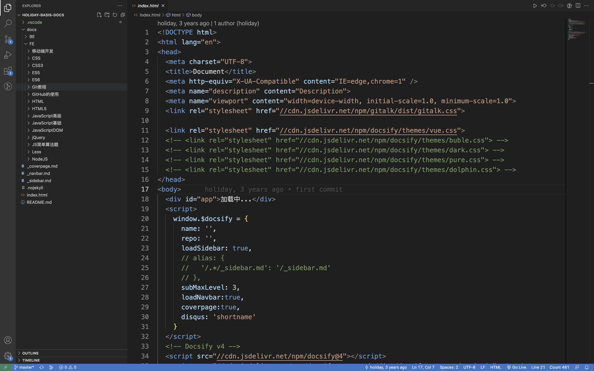

# 使用docsify进行在线知识管理

## 1.介绍

[docsify官方文档](https://docsify.js.org/#/zh-cn/)


## 2.结合自己以前写的2个demo进行介绍

- [前端技能的知识管理](https://wenhao-liao.github.io/holiday-docs/#/)
- [前端基础面试题的知识管理](https://github.com/Wenhao-liao/interview-docs)

demo里面主要包含下面几个方面的内容（所有内容都可以在官方文档里面找到）

1.初始化项目

2.配置文档

3.配置侧边栏

4.配置封面

5.配置导航栏

6.插件使用

7.部署到Github page




```java
<!DOCTYPE html>
<html lang="en">
<head>
  <meta charset="UTF-8">
  <title>Document</title>
  <meta http-equiv="X-UA-Compatible" content="IE=edge,chrome=1" />
  <meta name="description" content="Description">
  <meta name="viewport" content="width=device-width, initial-scale=1.0, minimum-scale=1.0">
  <link rel="stylesheet" href="//cdn.jsdelivr.net/npm/gitalk/dist/gitalk.css">

  <link rel="stylesheet" href="//cdn.jsdelivr.net/npm/docsify/themes/vue.css">
  <!-- <link rel="stylesheet" href="//cdn.jsdelivr.net/npm/docsify/themes/buble.css"> -->
  <!-- <link rel="stylesheet" href="//cdn.jsdelivr.net/npm/docsify/themes/dark.css"> -->
  <!-- <link rel="stylesheet" href="//cdn.jsdelivr.net/npm/docsify/themes/pure.css"> -->
  <!-- <link rel="stylesheet" href="//cdn.jsdelivr.net/npm/docsify/themes/dolphin.css"> -->
</head>
<body>
  <div id="app">加载中...</div>
  <script>
    window.$docsify = {
      name: '',
      repo: '',
      loadSidebar: true,  
      // alias: {
      //   '/.*/_sidebar.md': '/_sidebar.md'
      // },
      subMaxLevel: 3,
      loadNavbar:true,
      coverpage:true,
      disqus: 'shortname'
    }
  </script>
  <!-- Docsify v4 -->
  <script src="//cdn.jsdelivr.net/npm/docsify@4"></script>
  <script src="//cdn.jsdelivr.net/npm/docsify-copy-code/dist/docsify-copy-code.min.js"></script>
  <script src="//cdn.jsdelivr.net/npm/docsify/lib/plugins/search.min.js"></script>
  <!-- <script src="//cdn.jsdelivr.net/npm/docsify/lib/plugins/disqus.min.js"></script> -->

<script src="//cdn.jsdelivr.net/npm/docsify/lib/plugins/gitalk.min.js"></script>
<script src="//cdn.jsdelivr.net/npm/gitalk/dist/gitalk.min.js"></script>
<script>
  const gitalk = new Gitalk({ 
    clientID: 'e544ee0ab1a697122f08',
    clientSecret: 'bad43996938a482e371aba80e41970886e840967',
    repo: 'holiday_docs_comments',
    owner: 'Wenhao-liao',
    admin: ['Wenhao-liao'],
    // facebook-like distraction free mode
    distractionFreeMode: false,
    id: decodeURI(window.location.pathname),
  })
</script>
</body>
</html>
```