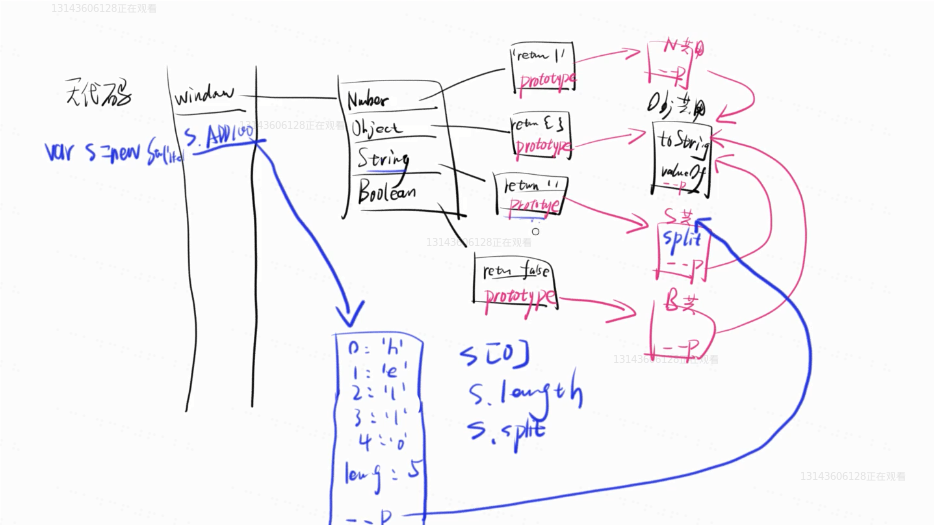
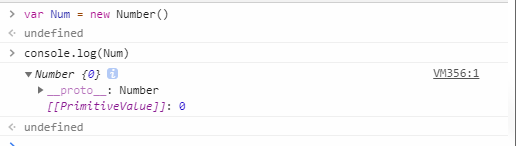
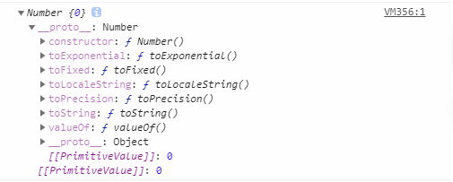
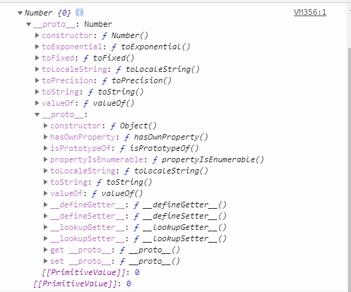
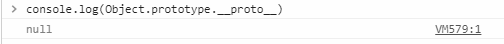

# 原型与原型链

## 简单说明

原型就是堆内存里面的一个对象

原型链就是原型的引用引申出来的链


## 具体

原型链的源头是Object的`__proto__`    它的值是null



如图所示：

不写代码的时候，浏览器也会自动生成一个window对象，该对象有很多属性，包括：

Number

String

Boolean

Object

...


上述的每个对象都有一个`__proto__`属性，指向另外一些对象，包括Number.prototype, String.prototype, Boolean.prototype, Object.prototype等，这些对象有一些属性，比如Number.prototype有：

```js
{
constructor: ƒ Number()
toExponential: ƒ toExponential()
toFixed: ƒ toFixed()
toLocaleString: ƒ toLocaleString()
toPrecision: ƒ toPrecision()
toString: ƒ toString()
valueOf: ƒ valueOf()
__proto__: Object
}     //Number的prototype   也就是原型
```


## 举例说明

比如当我们声明并赋值一个变量    `var Num = new Number();`

当我们在控制台打印 `console.log(Num)`

可以看到



Num这种基本包装类型转换成对象后，里面有一个`__proto__`的属性，值为Number，继续点击`__proto__`后：



可以看到，`__proto__`指向的就是Number.prototype，然后Number.prototype里面还有`__proto__`,继续点击：



可以看到，`__proto__`指向的就是Object.prototype，里面没有`__proto__`，但是如果我们打印

`console.log(Object.prototype.__proto__)`   



可以看到，它是null，不是undefined，这也是原型链的终点


因此，完整原型链是：

num变量 ----------->  Number.prototype ------->  Object.prototype -------> null        ------->其实就是`__proto__`

其他对象同理