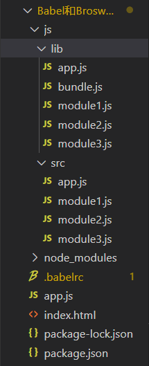

# 模块化

## 前言

早期的javascript版本没有块级作用域、没有类、没有包、也没有模块，这样会带来一些问题，如复用、依赖、冲突、代码组织混乱等，随着前端的膨胀，模块化显得非常迫切。


## 1.模块化的理解

### 1.1 什么是模块化

JavaScript在早期的设计中就没有模块、包、类的概念，开发者需要模拟出类似的功能，来隔离、组织复杂的JavaScript代码，我们称为模块化。具体实现思路是：

- 将一个复杂的程序依据一定的规则(规范)封装成几个块(文件), 并进行组合在一起
- 块的内部数据与实现是私有的, 只是向外部暴露一些接口(方法)与外部其它模块通信


### 1.2 模块化的进化过程

#### 1.2.1 全局function模式

- 编码: 将不同的功能封装成不同的全局函数
- 问题: 污染全局命名空间, 容易引起命名冲突或数据不安全，而且模块成员之间看不出直接关系

```js
function m1(){
  //...
}
function m2(){
  //...
}
```


#### 1.2.2 命名空间模式：简单对象封装

- 作用: 减少了全局变量，解决命名冲突
- 问题: 数据不安全(外部可以直接修改模块内部的数据)

```js
let myModule = {
  data: 'www.baidu.com',
  foo() {
    console.log(`foo() ${this.data}`)
  },
  bar() {
    console.log(`bar() ${this.data}`)
  }
}
myModule.data = 'other data' // 能直接修改模块内部的数据
myModule.foo() // foo() other data
```

这样的写法会暴露所有模块成员，内部状态可以被外部改写。


#### 1.2.3 IIFE模式：匿名函数自调用

- 作用: 数据是私有的, 外部只能通过暴露的方法操作
- 编码: 将数据和行为封装到一个函数内部, 通过给window添加属性来向外暴露接口
- 问题: 如果当前这个模块依赖另一个模块怎么办?

```html
<!-- index.html文件 -->
<script type="text/javascript" src="module.js"></script>
<script type="text/javascript">
    myModule.foo()
    myModule.bar()
    console.log(myModule.data) //undefined 不能访问模块内部数据
    myModule.data = 'xxxx' //不是修改的模块内部的data
    myModule.foo() //没有改变
</script>
```


```js
// module.js文件
(function(window) {
  let data = 'www.baidu.com'
  //操作数据的函数
  function foo() {
    //用于暴露有函数
    console.log(`foo() ${data}`)
  }
  function bar() {
    //用于暴露有函数
    console.log(`bar() ${data}`)
    otherFun() //内部调用
  }
  function otherFun() {
    //内部私有的函数
    console.log('otherFun()')
  }
  //暴露行为
  //为了在模块内部调用全局变量，必须显式地将其他变量输入模块，让依赖关系更明显。
  window.myModule = { foo, bar }
})(window, jQuery)
```

最后得到的结果：


#### 1.2.4 IIFE模式增强：引入依赖

```js
// module.js文件
(function(window, $) {
  let data = 'www.baidu.com'
  //操作数据的函数
  function foo() {
    //用于暴露有函数
    console.log(`foo() ${data}`)
    $('body').css('background', 'red')
  }
  function bar() {
    //用于暴露有函数
    console.log(`bar() ${data}`)
    otherFun() //内部调用
  }
  function otherFun() {
    //内部私有的函数
    console.log('otherFun()')
  }
  //暴露行为
  //为了在模块内部调用全局变量，必须显式地将其他变量输入模块,让依赖关系更明显。
  window.myModule = { foo, bar }
})(window, jQuery)
```

```js
 // index.html文件
  <!-- 引入的js必须有一定顺序 -->
  <script type="text/javascript" src="jquery-1.10.1.js"></script>
  <script type="text/javascript" src="module.js"></script>
  <script type="text/javascript">
    myModule.foo()
  </script>
```


### 1.3 模块化的好处

+ 避免命名冲突（减少命名控件污染）
+ 更好地分离，按需加载
+ 提高代码复用性
+ 提高可维护性


### 1.4 传统模块化的问题

引入多个`<script>`后出现问题

+ 请求过多

  依赖多个模块的时候，就会发送多个请求，导致请求过多

+ 依赖模糊

  依赖关系不明确的时候，放置`<script>`的时候，容易因为顺序出错导致出错（用到依赖还没加载）

+ 难以维护

  基于上面第二点原因，当`<script>`较多的时候，容易因为加载顺序不正确而出错，导致难以维护

  

  为了解决以上问题，我们可以通过模块化规范来解决，下面介绍最流行的common.js，AMD，ES6，CMD规范

  

  


## 2.模块化规范

### 2.1 CommomJS

#### 2.1.1 概述

Node 应用由模块组成，采用 CommonJS 模块规范。每个文件就是一个模块，有自己的作用域。在一个文件里面定义的变量、函数、类，都是私有的，对其他文件不可见。**在服务器端，模块的加载是运行时同步加载的；在浏览器端，模块需要提前编译打包处理。**

**一般用在服务器端。**


#### 2.1.3 特点

- 所有代码都运行在模块作用域，不会污染全局作用域。
- 模块可以多次加载，但是**只会在第一次加载时运行一次，然后运行结果就被缓存了**，以后再加载，就直接读取缓存结果。要想让模块再次运行，必须**清除缓存**。
- 模块**加载的顺序**，按照其在代码中**出现的顺序**
- 引用模块则需要通过 require 函数，它的基本功能是，读入并执行一个 JavaScript 文件，然后返回该模块的 exports 对象


#### 2.1.4 基本语法

- 暴露模块：`module.exports = value`或`exports.xxx = value`
- 引入模块：`require(xxx)`,如果是第三方模块，xxx为模块名；如果是自定义模块，xxx为模块文件路径


#### 2.1.5 特性

+ **CommonJS模块的加载机制是，输入的是被输出的值的拷贝。也就是说，一旦输出一个值，模块内部的变化就影响不到这个值**。这点与ES6模块化有重大差异（下文会介绍），请看下面这个例子：

  ```js
  // a.js
  var a = '';
  setTimeout(() => a = 'a', 500);
  module.exports = a
  
  // b.js
  var a = require('./a.js')
  console.log(a) // ''
  setTimeout(() => console.log(a), 1000) // ''
  ```

  这样会打印2个空字符串，因为模块内部的变化影响不到这个值了，所以a.js的定时器没有改变b里面a的值

  

#### 2.1.6 使用

（1）服务端使用

**①下载安装node.js**

**②创建项目结构**

**注意：用npm init 自动生成package.json时，package name(包名)不能有中文和大写**

```json
|-modules
  |-module1.js
  |-module2.js
  |-module3.js
|-app.js
|-package.json
  {
    "name": "commonJS-node",
    "version": "1.0.0"
  }
```

**③下载第三方模块**

```
npm install uniq --save // 用于数组去重
```

**④定义模块代码**

```js
//module1.js
module.exports = {
  msg: 'module1',
  foo() {
    console.log(this.msg)
  }
}

//module2.js
module.exports = function() {
  console.log('module2')
}

//module3.js
exports.foo = function() {
  console.log('foo() module3')
}
exports.arr = [1, 2, 3, 3, 2]

// app.js文件
// 引入第三方库，应该放置在最前面
let uniq = require('uniq')
let module1 = require('./modules/module1')
let module2 = require('./modules/module2')
let module3 = require('./modules/module3')

module1.foo() //module1
module2() //module2
module3.foo() //foo() module3
console.log(uniq(module3.arr)) //[ 1, 2, 3 ]

```

**⑤通过node运行app.js**

命令行输入`node app.js`，运行JS文件


（2）浏览器端使用

需要借助Browserify

**①创建项目结构**

```
|-js
  |-dist //打包生成文件的目录
  |-src //源码所在的目录
    |-module1.js
    |-module2.js
    |-module3.js
    |-app.js //应用主源文件
|-index.html //运行于浏览器上
|-package.json
  {
    "name": "browserify-test",
    "version": "1.0.0"
  }
```

**②下载browserify**

- 全局: npm install browserify -g
- 局部: npm install browserify --save-dev

**③定义模块代码(同服务器端)**

注意：`index.html`文件要运行在浏览器上，需要借助browserify将`app.js`文件打包编译，如果直接在`index.html`引入`app.js`就会报错！

**④打包处理js**

根目录下运行`browserify js/src/app.js -o js/dist/bundle.js`

**⑤页面使用引入**

在index.html文件中引入`<script type="text/javascript" src="js/dist/bundle.js"></script>`


### 2.2 AMD

CommonJS规范加载模块是同步的，也就是说，只有加载完成，才能执行后面的操作。AMD规范则是非同步加载模块，允许指定回调函数。由于Node.js主要用于服务器编程，模块文件一般都已经存在于本地硬盘，所以加载起来比较快，不用考虑非同步加载的方式，所以CommonJS规范比较适用。但是，**如果是浏览器环境，要从服务器端加载模块，这时就必须采用非同步模式，因此浏览器端一般采用AMD规范**。此外AMD规范比CommonJS规范在浏览器端实现要来着早。

**用在浏览器端。**


#### (1)AMD规范基本语法

**定义暴露模块**:

```js
//定义没有依赖的模块
define(function(){
   return 模块
})

//定义有依赖的模块
define(['module1', 'module2'], function(m1, m2){
   return 模块
})
```

**引入使用模块**:

```
require(['module1', 'module2'], function(m1, m2){
   使用m1/m2
})
```

#### (2)未使用AMD规范与使用require.js

通过比较两者的实现方法，来说明使用AMD规范的好处。

- 未使用AMD规范

```js
// dataService.js文件
(function (window) {
  let msg = 'www.baidu.com'
  function getMsg() {
    return msg.toUpperCase()
  }
  window.dataService = {getMsg}
})(window)

// alerter.js文件
(function (window, dataService) {
  let name = 'Tom'
  function showMsg() {
    alert(dataService.getMsg() + ', ' + name)
  }
  window.alerter = {showMsg}
})(window, dataService)

// main.js文件
(function (alerter) {
  alerter.showMsg()
})(alerter)

// index.html文件
<div><h1>Modular Demo 1: 未使用AMD(require.js)</h1></div>
<script type="text/javascript" src="js/modules/dataService.js"></script>
<script type="text/javascript" src="js/modules/alerter.js"></script>
<script type="text/javascript" src="js/main.js"></script>

```

最后得到如下结果：


这种方式缺点很明显：**首先会发送多个请求，其次引入的js文件顺序不能搞错，否则会报错！**

- 使用require.js

RequireJS是一个工具库，主要用于客户端的模块管理。它的模块管理遵守AMD规范，**RequireJS的基本思想是，通过define方法，将代码定义为模块；通过require方法，实现代码的模块加载**。 接下来介绍AMD规范在浏览器实现的步骤：

#### ①下载require.js, 并引入

- 官网: `http://www.requirejs.cn/`
- github : `https://github.com/requirejs/requirejs`

然后将require.js导入项目: js/libs/require.js

#### ②创建项目结构

```json
|-js
  |-libs
    |-require.js
  |-modules
    |-alerter.js
    |-dataService.js
  |-main.js
|-index.html

```

#### ③定义require.js的模块代码

```js
// dataService.js文件
// 定义没有依赖的模块
define(function() {
  let msg = 'www.baidu.com'
  function getMsg() {
    return msg.toUpperCase()
  }
  return { getMsg } // 暴露模块
})

//alerter.js文件
// 定义有依赖的模块
define(['dataService'], function(dataService) {
  let name = 'Tom'
  function showMsg() {
    alert(dataService.getMsg() + ', ' + name)
  }
  // 暴露模块
  return { showMsg }
})

// main.js文件
(function() {
  require.config({
    baseUrl: 'js/', //基本路径 出发点在根目录下
    paths: {
      //映射: 模块标识名: 路径
      alerter: './modules/alerter', //此处不能写成alerter.js,会报错
      dataService: './modules/dataService'
    }
  })
  require(['alerter'], function(alerter) {
    alerter.showMsg()
  })
})()

// index.html文件
<!DOCTYPE html>
<html>
  <head>
    <title>Modular Demo</title>
  </head>
  <body>
    <!-- 引入require.js并指定js主文件的入口 -->
    <script data-main="js/main" src="js/libs/require.js"></script>
  </body>
</html>

```

#### ④页面引入require.js模块:

在index.html引入 `<script data-main="js/main" src="js/libs/require.js"></script>`

**此外在项目中如何引入第三方库**？只需在上面代码的基础稍作修改：

```js
// alerter.js文件
define(['dataService', 'jquery'], function(dataService, $) {
  let name = 'Tom'
  function showMsg() {
    alert(dataService.getMsg() + ', ' + name)
  }
  $('body').css('background', 'green')
  // 暴露模块
  return { showMsg }
})

// main.js文件
(function() {
  require.config({
    baseUrl: 'js/', //基本路径 出发点在根目录下
    paths: {
      //自定义模块
      alerter: './modules/alerter', //此处不能写成alerter.js,会报错
      dataService: './modules/dataService',
      // 第三方库模块
      jquery: './libs/jquery-1.10.1' //注意：写成jQuery会报错
    }
  })
  require(['alerter'], function(alerter) {
    alerter.showMsg()
  })
})()
```

上例是在alerter.js文件中引入jQuery第三方库，main.js文件也要有相应的路径配置。 **小结**：通过两者的比较，可以得出**AMD模块定义的方法非常清晰，不会污染全局环境，能够清楚地显示依赖关系**。AMD模式可以用于浏览器环境，并且允许非同步加载模块，也可以根据需要动态加载模块。


### 2.3 CMD

CMD的加载方式更加优秀，是通过按需加载的方式，而不是必须在模块开始就加载所有的依赖。

CMD规范专门用于浏览器端，模块的加载是异步的，模块使用时才会加载执行。CMD规范整合了CommonJS和AMD规范的特点。在 Sea.js 中，所有 JavaScript 模块都遵循 CMD模块定义规范。

**用在浏览器端。**


#### (1)CMD规范基本语法

**定义暴露模块：**

```js
//定义没有依赖的模块
define(function(require, exports, module){
  exports.xxx = value
  module.exports = value
})

//定义有依赖的模块
define(function(require, exports, module){
  //引入依赖模块(同步)
  var module2 = require('./module2')
  //引入依赖模块(异步)
    require.async('./module3', function (m3) {
    })
  //暴露模块
  exports.xxx = value
})
```

**引入使用模块：**

```js
define(function (require) {
  var m1 = require('./module1')
  var m4 = require('./module4')
  m1.show()
  m4.show()
})
```


#### (2)sea.js简单使用教程

#### ①下载sea.js, 并引入

- 官网: [seajs.org/](http://seajs.org/)
- github : [github.com/seajs/seajs](https://github.com/seajs/seajs)

然后将sea.js导入项目: js/libs/sea.js

#### ②创建项目结构

```txt
|-js
  |-libs
    |-sea.js
  |-modules
    |-module1.js
    |-module2.js
    |-module3.js
    |-module4.js
    |-main.js
|-index.html
```

#### ③定义sea.js的模块代码

```js
// module1.js文件
define(function (require, exports, module) {
  //内部变量数据
  var data = 'atguigu.com'
  //内部函数
  function show() {
    console.log('module1 show() ' + data)
  }
  //向外暴露
  exports.show = show
})

// module2.js文件
define(function (require, exports, module) {
  module.exports = {
    msg: 'I Will Back'
  }
})

// module3.js文件
define(function(require, exports, module) {
  const API_KEY = 'abc123'
  exports.API_KEY = API_KEY
})

// module4.js文件
define(function (require, exports, module) {
  //引入依赖模块(同步)
  var module2 = require('./module2')
  function show() {
    console.log('module4 show() ' + module2.msg)
  }
  exports.show = show
  //引入依赖模块(异步)
  require.async('./module3', function (m3) {
    console.log('异步引入依赖模块3  ' + m3.API_KEY)
  })
})

// main.js文件
define(function (require) {
  var m1 = require('./module1')
  var m4 = require('./module4')
  m1.show()
  m4.show()
})
```

#### ④在index.html中引入

```html
<script type="text/javascript" src="js/libs/sea.js"></script>
<script type="text/javascript">
  seajs.use('./js/modules/main')
</script>
```

最后得到结果如下：


### 2.4 ES6模块化

AMD 、 CMD 等都是在原有JS语法的基础上二次封装的一些方法来解决模块化的方案，ES6 module（在很多地方被简写为 ESM）是语言层面的规范，ES6 module 旨在为浏览器和服务器提供通用的模块解决方案。长远来看，未来无论是基于 JS 的 WEB 端，还是基于 node 的服务器端或桌面应用，模块规范都会统一使用 ES6 module。


ES6 模块的设计思想是尽量的静态化，使得编译时就能确定模块的依赖关系，以及输入和输出的变量。CommonJS 和 AMD 模块，都只能在运行时确定这些东西。比如，CommonJS 模块就是对象，输入时必须查找对象属性。


#### 2.4.1 ES6模块化语法

export命令用于规定模块的对外接口，import命令用于输入其他模块提供的功能


```js
/** 定义模块 math.js **/
var basicNum = 0;
var add = function (a, b) {
    return a + b;
};
export { basicNum, add };
/** 引用模块 **/
import { basicNum, add } from './math';
function test(ele) {
    ele.textContent = add(99 + basicNum);
}
```


如上例所示，使用import命令的时候，用户需要知道所要加载的变量名或函数名，否则无法加载。为了给用户提供方便，让他们不用阅读文档就能加载模块，就要用到export default命令，为模块指定默认输出。


```js
// export-default.js
export default function () {
  console.log('foo');
}
```


```js
// import-default.js
import customName from './export-default';
customName(); // 'foo'
```


模块默认输出, 其他模块加载该模块时，import命令可以为该匿名函数指定任意名字。


#### 2.4.2 ES6 模块与 CommonJS 模块的差异

**① CommonJS 模块输出的是一个值的拷贝，ES6 模块输出的是值的引用**

**② CommonJS 模块是运行时加载，ES6 模块是编译时输出接口**


```js
// export-default.js
export var a = '';
setTimeout(() => a = 'a', 500);

// import-default.js
import { a } from './exportTest.js'
console.log(a) // ''
setTimeout(() => console.log(a), 1000) // 'a'
```

运行后可以看到，上面依次打印的是空字符串和 ’a‘，意思是模块内部的变化就影响了这个值


#### 2.4.3 使用

通常我们会借助Babel和Browserify来使用ES6的模块化


下面介绍ES6-Babel-Browserify使用教程

简单来说就一句话：

**使用Babel将ES6编译为ES5代码，使用Browserify编译打包js**


步骤：

1. 定义package.json文件

   ```js
    {
      "name" : "es6-babel-browserify",
      "version" : "1.0.0"
    }
   ```

2. 安装 babel-cli,babel-preset-es2015和 browserify

   - npm install babel-cli browserify -g

   - npm install babel-preset-es2015 --save-dev

     

3. 定义.babelrc文件

   ```json
     {
       "presets": ["es2015"]
     }
   ```

4. 定义模块代码

   ```js
   //module1.js文件
   // 分别暴露
   export function foo() {
     console.log('foo() module1')
   }
   export function bar() {
     console.log('bar() module1')
   }
   ```

   ```js
   //module2.js文件
   // 统一暴露
   function fun1() {
     console.log('fun1() module2')
   }
   function fun2() {
     console.log('fun2() module2')
   }
   export { fun1, fun2 }
   ```

   ```js
   //module3.js文件
   // 默认暴露 可以暴露任意数据类项，暴露什么数据，接收到就是什么数据
   export default () => {
     console.log('默认暴露')
   }
   ```

   ```js
   // app.js文件
   import { foo, bar } from './module1'
   import { fun1, fun2 } from './module2'
   import module3 from './module3'
   foo()
   bar()
   fun1()
   fun2()
   module3()
   ```


5. 编译并在index.html中引入
   - 使用Babel将ES6编译为ES5代码(但包含CommonJS语法) : `babel js/src -d js/lib`
   - 使用Browserify编译js : `browserify js/lib/app.js -o js/lib/bundle.js`


然后在index.html文件中引入

```html
 <script type="text/javascript" src="js/lib/bundle.js"></script>
```


**此外第三方库(以jQuery为例)如何引入呢**？ 首先安装依赖`npm install jquery@1` 然后在app.js文件中引入

```js
//app.js文件
import { foo, bar } from './module1'
import { fun1, fun2 } from './module2'
import module3 from './module3'
import $ from 'jquery'

foo()
bar()
fun1()
fun2()
module3()
$('body').css('background', 'green')
```


整个目录如下：




### 2.5 模块化规范简单总结

1）CommonJS服务器端和浏览器端都可以用（一般在服务端使用，在浏览器需要用Browserify编译），服务器端是动态**同步**加载模块的，浏览器端需要先**编译**打包所有用到的模块 

2）AMD和CMD都专供浏览器端，动态异步加载模块 。

​	实际上AMD是RequireJS在推广过程中对模块定义的规范化的产出；CMD（通用模块定义）是SeaJS 在推广过程中被广泛认知。

​	CMD和AMD的区别有以下几点：

​	1.对于依赖的模块AMD是提前执行，CMD是延迟执行。不过RequireJS从2.0开始，也改成可以延迟执行（根据写法不同，处理方式不		通过）。

​	2.CMD推崇依赖就近，AMD推崇依赖前置。

3）ES6服务器端和浏览器端都可以用，但都需要先编译打包所有用到的模块，ES6 在语言标准的层面上，实现了模块功能，而且实现得相当简单，完全可以取代 CommonJS 和 AMD 规范，成为浏览器和服务器通用的模块解决方案


## 3.总结

看完这篇文章你应该可以尝试回答下面几个问题：

什么是模块化？

以前是怎么做模块化的？以前做模块化的各个方案有什么优缺点？

什么是模块化规范？有哪几种模块化规范？

几种模块化规范是怎么使用的？用在服务端还是浏览器端？


如果对上面几个问题有疑问，请重新阅读以下本文。


## 参考资料

[JS模块化编程](http://www.ruanyifeng.com/blog/2012/10/javascript_module.html)

[CMD,AMD和COMMONJS区别](https://www.iteye.com/blog/zccst-2215317)

[【深度全面】前端JavaScript模块化规范进化论](https://segmentfault.com/a/1190000023711059)

[30分钟学会前端模块化开发](https://www.cnblogs.com/best/p/10076782.html)

