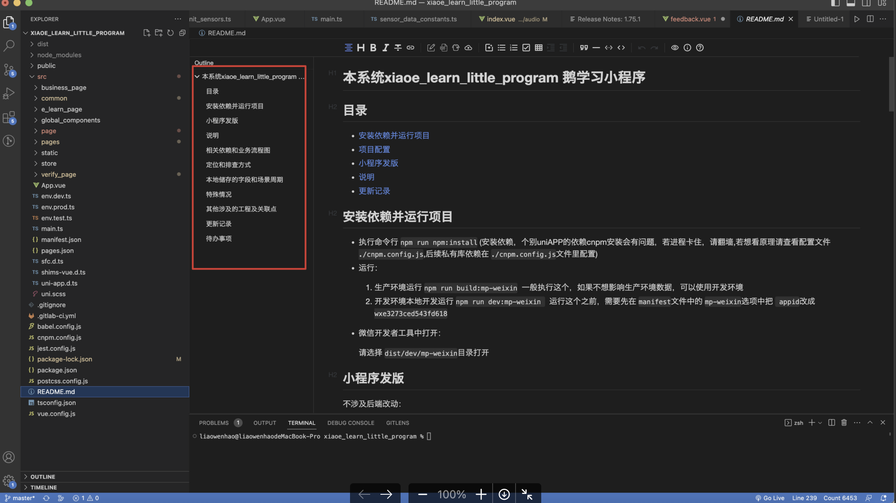
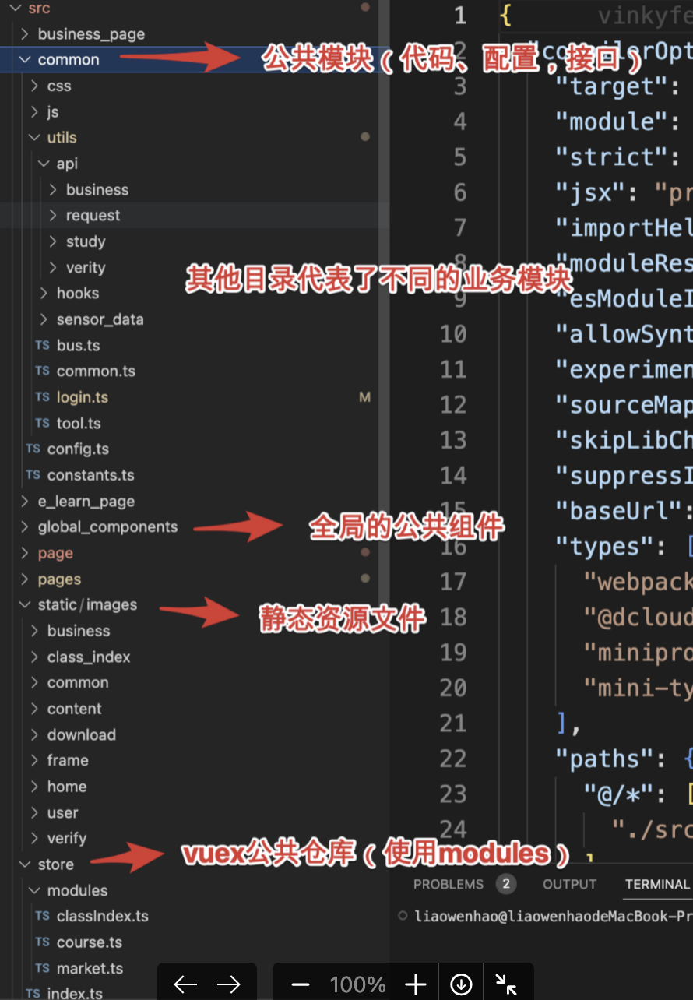
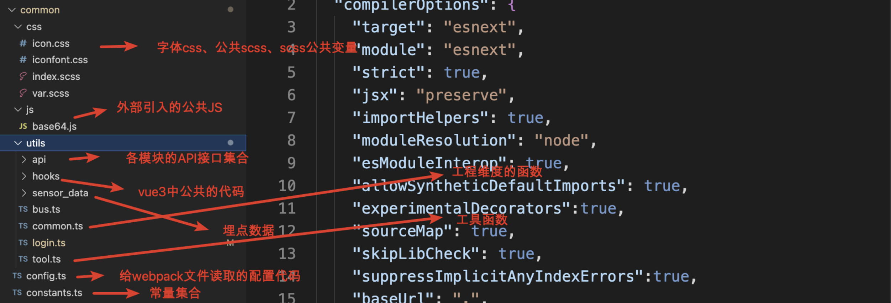
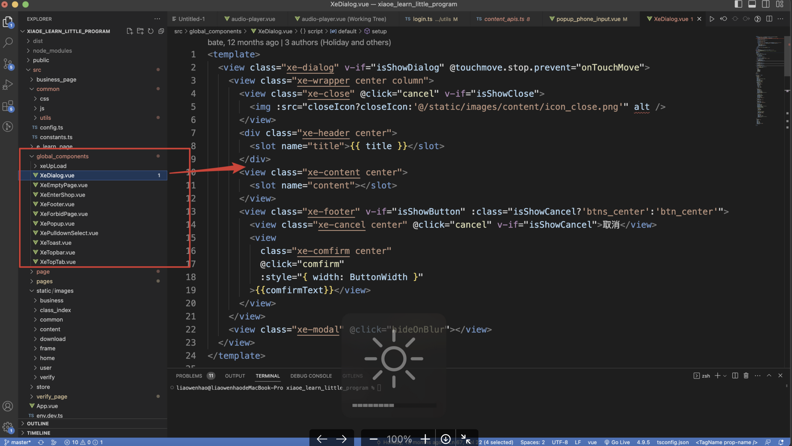
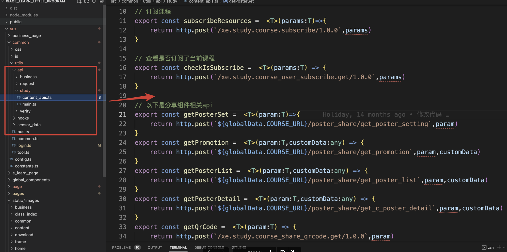
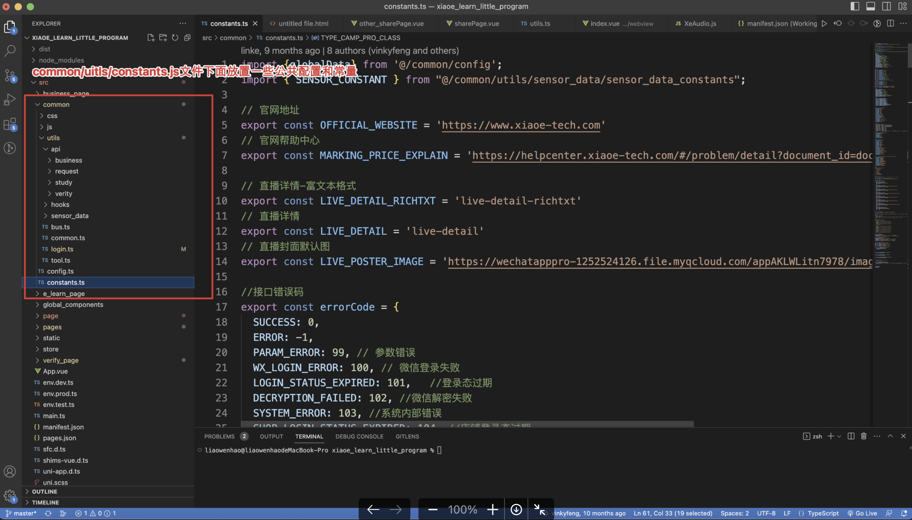

# **管理工程和代码**实践分享

结合某参与的从0到1搭建的工程谈谈个人觉得**管理工程和代码**比较好的实践：

## 1.重视readme文件




## 2.技术选型和最佳实践

框架上使用最佳实践

可以使用框架（比如vue2）的一些最佳实践

或者直接选用更加先进的技术栈，比如本工程里面的`vue3+TS` 技术栈


## 3.合理架构目录




## 4.工程中公共模块

**如上图，可以把工程中一些公共的或者是全局维度的部分抽离出来**



**全局公共组件：**



**API接口详情：**



**常量和配置详情：**




## 5.代码风格

### 命名风格指南

1. 文件名命名统一风格

   下划线或者短横线

2. Vue的单文件组件

   推荐PascalCase，例如`TodoList.vue` 、`SearchButtonClear.vue` 、`StudentDashboardSettings.vue`

3. 组件名

   使用PascalCaseTodoList，在作为标签使用的时候使用`<TodoList></TodoList>`

4. props

   `props:{ greetingText:String }` 在父组件模版 中使用作为属性书写的时候，使用`<WelcomeMessage greeting-text="hi"/>` （事实上，`<WelcomeMessage greetingText="hi"/>`）也能生效

   > 对于组件名我们推荐使用 **[PascalCase](https://cn.vuejs.org/guide/components/registration.html#component-name-casing)**，因为这提高了模板的可读性，能帮助我们区分 Vue 组件和原生 HTML 元素。然而对于传递 props 来说，使用 camelCase 并没有太多优势，因此我们推荐更贴近 HTML 的书写风格

5. 路由风格：

   `path:’/user-info’`   ，原因：因为搜索引擎需要区分语义，因此`path:’/path_info’`

6. 变量和方法：

   应该具有语义化，表明变量的意思和方法的作用

7. 常量：

   `const MAX_COUNT = 10`

8. 自定义事件

   `<MyComponent @my-event="handleDoSomething" />`

   触发：`<MyComponent @my-event="handleDoSomething" />` 或者`<MyComponent @myEvent="handleDoSomething" />`

   而为了区分_原生事件_和_自定义事件_在 Vue 中的使用，建议除了多单词事件名使用 kebab-case 的情况下，命名还需遵守为 **`on` + 动词** 的形式，如下：

   ```jsx
   <!-- 父组件 -->
   <div
     @on-search="handleSearch"
     @on-clear="handleClear"
     @on-clickoutside="handleClickOutside">
   </div>
   ```


### vue2推荐的最佳实践

**1.代码结构**

组件推荐使用单文件组件的形式去书写，并且按照**`template⇒script⇒style`**的顺序去书写

**2.`data`必须是一个函数返回**

这个事实上也是vue必须的要求，使得每个使用的组件实例维护自身的数据

**3.`props`有校验就多写校验**

多写校验能够规范调用者让他们使用正确的方式

**4.应该把复杂计算属性分割为尽可能多的更简单的属性。**

​	小的、专注的计算属性减少了信息使用时的假设性限制，所以需求变更时也用不着那么多重构了。

```jsx
// bad
computed: { 
  price: function () { 
    var basePrice = this.manufactureCost / (1 - this.profitMargin) 
    return ( 
      basePrice - 
      basePrice * (this.discountPercent || 0) 
    ) 
  } 
}

// good
computed: {
  basePrice: function () {
    return this.manufactureCost / (1 - this.profitMargin)
  },
  discount: function () {
    return this.basePrice * (this.discountPercent || 0)
  },
  finalPrice: function () {
    return this.basePrice - this.discount
  }
}
```


**5.为 `v-for` 设置键值**

复用元素，提升遍历的效率

**6.不要把 `v-if` 和 `v-for` 同时用在同一个元素上。**

一般我们在两种常见的情况下会倾向于这样做：

- 为了过滤一个列表中的项目 (比如 `v-for="user in users" v-if="user.isActive"`)。在这种情形下，请将 `users` 替换为一个计算属性 (比如 `activeUsers`)，让其返回过滤后的列表。

  ```jsx
  computed: {
    activeUsers: function () {
      return this.users.filter((user) => {
        return user.isActive
      })
    }
  }
  ```

  ```jsx
  <ul>
    <li
      v-for="user in activeUsers"
      :key="user.id">
        {{ user.name }}
    </li>
  </ul>
  ```

- 为了避免渲染本应该被隐藏的列表 (比如 `v-for="user in users" v-if="shouldShowUsers"`)。这种情形下，请将 `v-if` 移动至容器元素上 (比如 `ul`, `ol`)

  ```jsx
  <!-- bad -->
  <ul>
    <li
      v-for="user in users"
      v-if="shouldShowUsers"
      :key="user.id">
        {{ user.name }}
    </li>
  </ul>
  
  <!-- good -->
  <ul v-if="shouldShowUsers">
    <li
      v-for="user in users"
      :key="user.id">
        {{ user.name }}
    </li>
  </ul>
  ```

**7.组件模板应该只包含简单的表达式，复杂的表达式则应该重构为计算属性或方法。**

复杂表达式会让你的模板变得不那么**声明式**。我们应该尽量描述应该出现的**是什么**，而非**如何**计算那个值。而且计算属性和方法使得代码可以重用。

```jsx
// bad
{{
  fullName.split(' ').map((word) => {
    return word[0].toUpperCase() + word.slice(1)
  }).join(' ')
}}
```

更好的做法

```html
<!-- 在模板中 -->
{{ normalizedFullName }}
```

```jsx
// 复杂表达式已经移入一个计算属性
computed: {
  normalizedFullName: function () {
    return this.fullName.split(' ').map(function (word) {
      return word[0].toUpperCase() + word.slice(1)
    }).join(' ')
  }
}
```

**8.指令缩写，让模版更简洁**

- **用 `:` 表示 `v-bind:`**
- **用 `@` 表示 `v-on:`**
- **用 `#` 表示 `v-slot:`**


### ES6+的API的使用

三元运算符、解构、数组相关API、字符串相关API、模版字符串、展开运算符等等

可以参考

[JavaScript 开发人员需要知道的简写技巧 - 掘金](https://juejin.cn/post/6844903507149979655)


### 尽量少用if..else

1.简单的匹配可以使用`switch..case`

2.使用map的方式

- 简单匹配：换成对象键值匹配的方式

- 复杂判断：数组里面放各个子数组：对于子数组，数组[0]存判断，数组[1]存结果

  ```jsx
  // 获取符合条件的子数组
  const getDescribe = describeForNameMap.find((item) => item[0](name));
  // 子数组存在则运行子数组中的第二个元素（执行函数）
  getDescribe ? getDescribe[1]() : console.log("此人比较神秘！");
  ```

可以参考

[JavaScript | 1000个判断条件难道要写了1000个 if ? 一文教你如何实现分支优化 - 掘金](https://juejin.cn/post/7172147708914827300)


### 注释

目的：（**提高代码的可读性，从而提高代码的可维护性**）

- 变量：data，props，函数内部变量

- 函数

  ```jsx
  /**
     * 设置书本的页数
     * @param pageNum {number} 页数
  	 * @returns {Number|*}
     */
    setPageNum: function (pageNum) {
      this.pageNum=pageNum
  		return this.pageNum 
    }
  ```

- 特殊逻辑


**最后，风格良好的代码是一本简单易懂的故事书，即使是写业务代码实现业务，也希望大家都能用代码写书写优美的业务篇章**